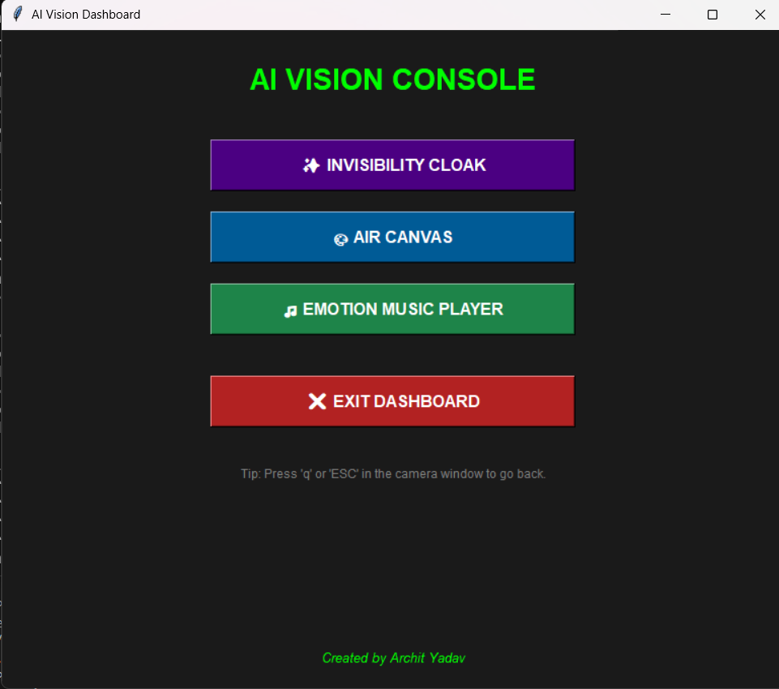
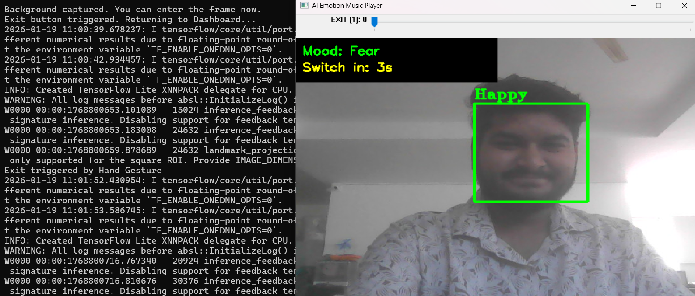
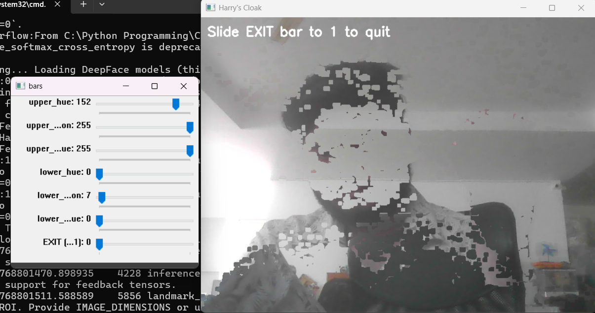
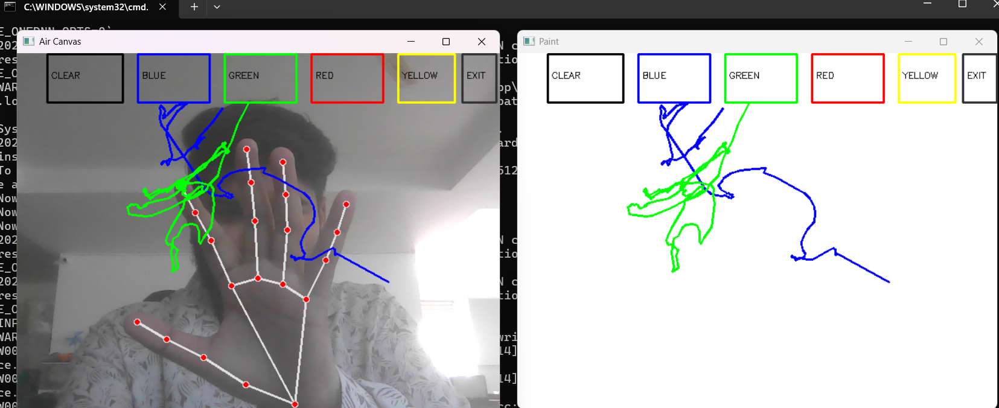

<div align="center">

# AI Vision Console 🤖✨


<br>
<br>



</div>

---

### 📝 Project Overview

This AI Vision Console is a centralized Python dashboard developed by **Archit Yadav**, designed to showcase the power of real-time computer vision. By integrating OpenCV, Mediapipe, and TensorFlow, the application features an interactive suite of projects including an Invisibility Cloak that utilizes color-based background substitution, an Air Canvas for touchless digital drawing via hand tracking, and an Emotion-based Music Player that curates playlists by analyzing facial expressions. Built with a clean, dark-themed Tkinter interface, the console serves as a professional portfolio piece that bridges advanced deep learning models with accessible, user-friendly desktop utility.

## 🌟 Feature Gallery

| 🎭 Emotion Detection | ✨ Invisibility Cloak | 🎨 Air Canvas |
| :---: | :---: | :---: |
|  |  |  |
| Real-time mood analysis | Color-based cloaking | Hand-tracking drawing |

## 🚀 Features

- **✨ Invisibility Cloak:** Uses color detection and background frame substitution to mimic the Harry Potter Invisibility Cloak.
- **🎨 Air Canvas:** Leveraging Mediapipe for hand tracking to draw on the screen in real-time.
- **🎵 Emotion Music Player:** Analyzes facial expressions to detect mood and suggest/play music accordingly.
- **🖥️ Centralized Dashboard:** A clean, dark-themed UI to launch all projects from one place.

## 🛠️ Technology Stack

- **Language:** Python 3.12
- **UI Framework:** Tkinter
- **Vision Libraries:** OpenCV, Mediapipe
- **Backend/DevOps:** FastAPI, Docker, Nginx, PostgreSQL
- **Deep Learning:** TensorFlow / Keras

## 📦 Installation & Setup

Follow these steps to get the project running on your local machine:

1. **Clone the repository:**
   ```bash
   git clone [https://github.com/ArchitYadav07/AI-Vision-App1.git](https://github.com/ArchitYadav07/AI-Vision-App1.git)
   cd AI-Vision-App1

```

2. **Create a Virtual Environment:**
```bash
python -m venv venv312

```


3. **Activate the Environment:**
* **Windows:** `.\venv312\Scripts\activate`
* **Mac/Linux:** `source venv312/bin/activate`


4. **Install Dependencies:**
```bash
pip install -r requirements.txt

```


## 🎮 How to Use

Run the main dashboard script:

```bash
python main_dashboard.py

```

* Select any project button to launch the camera window.
* **Tip:** Press `q` or `ESC` in any camera window to return to the main dashboard.

## 👤 Author

**Archit Yadav** [GitHub Profile](https://www.google.com/search?q=https://github.com/ArchitYadav07)

---

*Created for AI Vision exploration and Computer Vision learning.*
